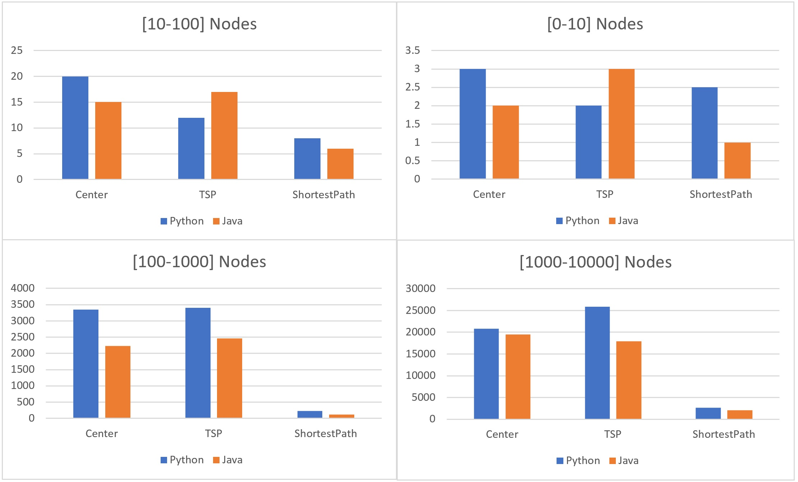

# Graph design

***
**Graph design** - 
>is an software tool for directed and undirected graphs. 
>it gives the user the ability to see the graph visually, get information about the graph and analyze it.
>all the information based on many algorithms and calculations simple and complicated together to give the best complexity possible.
>Graph design gives Graph theory students a new way to study and understand interacted graphs faster simpler and get productive.


# Departments

## Algo:
***
>this is the core class of Graph design. it contains multiple algorithms based on well known Graph theory algorithms like Dijkstra DFS and many more, the main method of this class is to disassemble those algorithms to smaller function in way they can use each other's information and sync with each other, what make Graph Design better quicker and simpler. the whole class outputs is based on the same results format so each function can help multiple answers for different user requests. the main algorithms are:

### getGraph:
>This function returns the graph object that was created in the builder, this type object DiGraph

### Dijakstra: 
> Dijkstra's algorithm is an algorithm for finding the shortest paths between nodes in a graph, which may represent, for example, road networks. It was conceived by computer scientist Edsger W. Dijkstra in 1956 and published three years later. *[4] [5] [6]*

>The algorithm exists in many variants. Dijkstra's original algorithm found the shortest path between two given nodes, *[6]* but a more common variant fixes a single node as the "source" node and finds shortest paths from the source to all other nodes in the graph, producing a shortest-path tree.

>For a given source node in the graph, the algorithm finds the shortest path between that node and every other. *[7]*: 196–206 It can also be used for finding the shortest paths from a single node to a single destination node by stopping the algorithm once the shortest path to the destination node has been determined. For example, if the nodes of the graph represent cities and edge path costs represent driving distances between pairs of cities connected by a direct road (for simplicity, ignore red lights, stop signs, toll roads and other obstructions), Dijkstra's algorithm can be used to find the shortest route between one city and all other cities. A widely used application of shortest path algorithms is network routing protocols, most notably IS-IS (Intermediate System to Intermediate System) and Open Shortest Path First (OSPF). It is also employed as a subroutine in other algorithms such as Johnson's.

### TSP:
>The travelling salesman problem (also called the travelling salesperson problem or TSP) asks the following question: "Given a list of cities and the distances between each pair of cities, what is the shortest possible route that visits each city exactly once and returns to the origin city?" It is an NP-hard problem in combinatorial optimization, important in theoretical computer science and operations research.

>The travelling purchaser problem and the vehicle routing problem are both generalizations of TSP.

>In the theory of computational complexity, the decision version of the TSP (where given a length L, the task is to decide whether the graph has a tour of at most L) belongs to the class of NP-complete problems. Thus, it is possible that the worst-case running time for any algorithm for the TSP increases superpolynomially (but no more than exponentially) with the number of cities. 


### CenterPoint:
> The center point in the graph is a point in the connected graph, where we look for all possible paths from each vertex and select for each vertex the longest path that exits and ends at a different vertex.
>Once we have created a list of the longest routes we will select the minimum route from all the routes and it will express the midpoint.

>In this function we will use a Dijakstra algorithm that finds all the paths from the resulting vertex.

### loadFromJson:
>This function expects to get a path to a file type *.json and using this file creates a new graph of type DiGraph
* Example json file
```json
{
"Edges": [
    {
        "src": 0,
        "w": 1.0,
        "dest": 1
    },
    {
        "src": 1,
        "w": 1.1,
        "dest": 0
    },
    {
        "src": 1,
        "w": 1.3,
        "dest": 2
    },
    {
        "src": 1,
        "w": 1.8,
        "dest": 3
    },
    {
        "src": 2,
        "w": 1.1,
        "dest": 3
    }
],
"Nodes": [
    {
        "id": 0
    },
    {
        "id": 1
    },
    {
        "id": 2
    },
    {
        "id": 3
    }
]
}

```

### saveToJson:
>This function expects to get a file name and will be used to create a json file representing the graph as an example above.

### PlotGraph:
> This function produces a graphical interface for displaying the graph, this function uses a library *matplotlib*


***
## Graph
>this class represent the graph itself, in another words this class is our graph data structure as it keep the graph data nodes and edges, all functions who change the graph our built in this class
***
### vSize:
> this function serves ass a getter to see how many nodes in the given graph
### eSize:
>same as "vSize" this function serves as a getter while here we get the the number of edges in the graph.
### getAllv:
>simply return the graph "nodeDict" who keep the list of the nodes in this graph
### all in edges of node:
>insted of creating a nother class for Nodes in this graph we add the requiers function in this class, the "all_in_edges" def returns a dict containig all the edges who comes out from the given node.
### all out edges of node:
> similarly to the previos function but here the outputs contains all edges who's thier dirction go into the given node.
### getMc
>after any changes the user apllied on the graph "mCount" obj is updated for an inside usement of other defs, what gives us the ability to save time and use previos data for the graph's algos insted of re run heavy def in case the graph haven't changed yet.
>getMc's output is is current verosin of the graph.

### addEdge
>this function create a new edge and adds it into both of the nodes In and Out dict, in case of a wrong input such as identical nodes, unexisted node or repeated edge "addEdge" will throw False output.
    
### addNode
>similarly to the previous function addNode is a methood to add new nodes to the graph, in case of wrong input such as unexisted nodes the function well return false and print Error message. 

### removeNode
>the function remove the given node from the graph and updated any aperences of the node in the In and Out edges dict, in order to keep the data updated for futre usement of the algorithems.      

### removeEdge
>similarly to "removeNode" this function removes and edge from the graph and update each of nodes edge dict In and Out and others of this class paremters for future use of the algorithems. 
      
### getJsonGraph
>"getJsonGraph" serves as a methood who returns a dict of edges and nodes what represent the graph as a dict.
>in case of the node doesn't contains a pos data this methood will add the node only by its id paramter.
*** 

## Nodes
>the "Nodes" class contains useful functions that and parameters who help the algorithems to work efficency such as "previous" and "visited" for the dirjkstra algo. yet most of the node function are still built in the graph class from in addition to make the algorithems more efficincy.

>in case that the constructor doesn't recives "pos" for the node the constuctor will create a random pos using the random lib.

### set_visited
> a setter fot the "visited" field in the Node obj whice used by the dijkstra algorithem in Algo.py.

### *___gt___* 
> this function serves as a comperator between two differents nodes.similarly to the previous function this methhod helps the dirjksta algorithem in Algo.py.

### *___repr___*
> this function wiil print the Node date sorted  by a list of Out edges and In Edges. (ToString/print).

***
# UnitTesting
>A unit test is a way of testing a unit - the smallest piece of code that can be logically isolated in a system. In most programming languages, that is a function, a subroutine, a method or property. ... Modern versions of unit testing can be found in frameworks like JUnit, or testing tools like TestComplete.

* TestDiGraph
 >In testing this unit we would like to check if each of the functions in the above class is indeed working as expected
 
* Example:
 ```py
    def __init__(self, methodName: str = ...) -> None:
        super().__init__(methodName=methodName)
        self.graph = DiGraph()
        for id in range(4):
            self.graph.add_node(id)

    def test_v_size(self):
        print("\nTest v_size")
        print("----------------------------")
        self.assertEqual(self.graph.v_size(), 4)
        self.graph.add_node(6)
        self.assertEqual(self.graph.v_size(), 5)
 ```   
>In this example we build a graph with 4 codes and perform a test on the function v_size() and expect to get truth that the function has indeed returned the expected value

>We will then get another vertex and perform the test again, which means that now the function will return true if the entered vertex increased the number of vertices in the graph

# UML:


## How to run:
```bash
# Clone the repository
$ git clone https://github.com/bsharabi/Graph-design_Py.git
# Go into the repository
$ cd Graph-design_Py
# Open the terminal on Windows
$ Run "py ./main.py"
# Open the terminal on Linux
$ Run "python3 ./main.py"
```
***
# Performence
***
## Java 
### [0-10] Nodes:
* center: 2 milliseconds	
* TSP: 3 milliseconds
* ShortestPath: 1 milliseconds

### [10-100] Nodes:
* center: 15 milliseconds
* TSP: 17 milliseconds
* ShortestPath: 6 milliseconds


### [100-1000] Nodes:
* center: 2228 milliseconds
* TSP: 2467 milliseconds
* ShortestPath: 120 milliseconds
  
### [1000-10000] Nodes:
* center: 19536 milliseconds
* TSP: 17946 milliseconds
* ShortestPath: 2051 milliseconds

## Python 
### [0-10] Nodes:
* center: 3 milliseconds	
* TSP: 2 milliseconds
* ShortestPath: 2 milliseconds

### [10-100] Nodes:
* center: 20 milliseconds
* TSP: 12 milliseconds
* ShortestPath: 8 milliseconds

### [100-1000] Nodes:
* center: 3348 milliseconds
* TSP: 3407 milliseconds
* ShortestPath: 230 milliseconds
  
### [1000-10000] Nodes:
* center: 20839 milliseconds
* TSP: 25876 milliseconds
* ShortestPath: 2637 milliseconds




